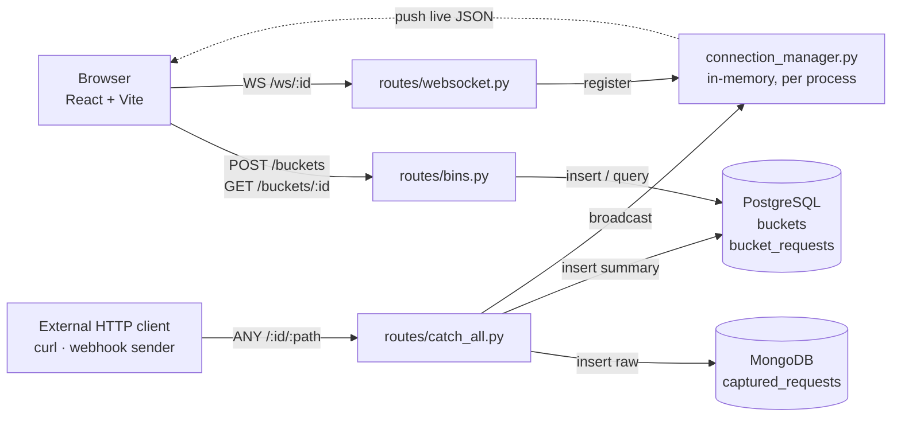

# ChummBucket

A self-hosted request bin. Create a **bucket**, get a public URL, point any
webhook or `curl` at it, and watch the requests land in your browser in real
time (headers, body, and all)!

---

## The Team

**Alyssa Easter** — [@alyssa43](https://github.com/alyssa43)
**Zach Fester** — [@ztfes](https://github.com/ztfes)
**Jack Sebben** — [@jackouni](https://github.com/)
**Vy Vu** — [@vyvu73](https://github.com/vyvu73)

We worked over Discord (chat and video), pair-programmed with VSCode LiveShare, tracked issues in Linear, and reviewed every change as a pull request on GitHub. Architecture was agreed on as a team *before* any feature code was written, and every PR was reviewed by a human regardless of how it was authored.

---

## What It Does

Debugging a webhook usually means guessing at what the sender actually
transmitted. ChummBucket removes the guessing: it gives you a URL that
accepts anything and shows you exactly what arrived.

- **Create a bucket** — one click, no account. You get a `public_id` (the URL
  anyone can send to) and a private `owner_token` (the secret that lets *you*
  read it back).
- **Receive anything** — any method, any path under your bucket, any body, from
  any origin. Nothing is rejected or validated.
- **Watch it live** — the inspector holds an open WebSocket, so captured
  requests appear the instant they arrive, with no refresh and no polling.
- **Inspect the detail** — method, path, timestamp, full header map, and body
  for every request, kept in order.

There are two visual themes — a straight **professional theme** and the **"ChummBucket" theme** *(toggled from the header)*.

---

# Hosted Version

This (eventually) is hosted on AWS: [link here] 

---

## Using the Application

Setup (dependencies, databases, migrations) lives in **[dev.md](dev.md)**. Once
you're set up, you need both processes running.

### 1. Start the backend

```bash
cd backend && source venv/bin/activate && uvicorn main:app --reload
```

Serves on `http://localhost:8000`. Interactive API docs are at
`http://localhost:8000/docs`.

### 2. Start the frontend

```bash
cd frontend && npm run dev
```

Serves on `http://localhost:5173`. Open that in a browser.

### 3. Create a bucket

Click **Create Bucket** on the landing page. The app calls `POST /buckets`,
stores the returned `owner_token` in `localStorage`, and routes you to
`/bin/:publicId` — the inspector for that bucket.

Copy the bucket URL from the top of the inspector.

## 4. Send it a request

Add any path you like on the end - the bucket accepts every path beneath it.

Point a real webhook provider at the same URL and it works identically.

### 5. Watch it arrive

The request appears in the inspector immediately - no refresh. Click any entry
to expand its headers and body. The connection indicator shows whether the live
socket is open.

### Ownership, in one paragraph

There are no accounts. The `owner_token` returned at creation is the only key to
a bucket's contents, and it lives in that browser's `localStorage`. **Clear your
browser storage and the bucket is unreadable forever** — the URL still captures
requests, but nothing can read them back. Opening the same bucket in a different
browser shows nothing, by design.

---

## Architecture

The full architecture write-up, with diagram, is
**[images/Request Bin Architecture v2 README.html](images/Request%20Bin%20Architecture%20v2%20README.html)** —
open it in a browser.

The short version: one FastAPI process, two entry points.



The browser owns the read path and the socket. Any outside caller lands in
`catch_all.py`, which writes to both databases and then fans the capture out
through the connection manager to every socket watching that bucket.

---

## Design Decisions and Trade-offs

Everything here was a deliberate choice with a cost attached. 
The costs are listed honestly:

### Two databases

**Decision:** Every capture is written twice: the full raw request goes to
MongoDB (`captured_requests`) as a schemaless document with headers, query
params, remote address, and the body base64-encoded; a flattened summary row
goes to PostgreSQL (`bucket_requests`) with the columns the UI actually lists.

**Why:** Captured requests are the definition of unstructured input — arbitrary
headers, arbitrary bodies, possibly not even text. Forcing that into a
relational schema means either losing fidelity or filling a table with `NULLABLE`
columns. But the *questions* the app asks are relational: which bucket, in what
order, how many.

**Trade-off:** Two datastores to install, run, migrate, and reset — which is why
[dev.md](dev.md) has a whole database-reset procedure (this is for the local development environments with dummy/test data - this should **never** be used in production). 

Worse, the two writes aren't a single transaction: if the Postgres insert fails after the Mongo insert
succeeds, an orphaned document is left behind. We accepted that because an orphan in a local debugging tool costs nothing, a distributed transaction would have cost.

### No accounts: a token in `localStorage`

**Decision:** A bucket is a `public_id` plus an
`owner_token`. Reads require the token in an `Owner-Token` header. The browser keeps it in `localStorage`.

**Why:** The tool is worthless if using it requires signing up first. Splitting
the identifier in two gets ownership without building auth: the URL you hand out
is not the credential that reads the results.

**Trade-off:** Real costs, all accepted knowingly: clearing browser storage
permanently orphans the bucket, there's no way to open a bucket on a second
device or share it with a teammate, no recovery or rotation exists. For a local tool with minimal scale (at least for now) with no sensitive data, none of these outweighed skipping an entire auth subsystem.

---

## Contributing

Branch naming, PR workflow, local setup, and the database-reset procedure are
all in **[dev.md](dev.md)**.

> "A problem well stated is a problem half solved." — Charles Kettering